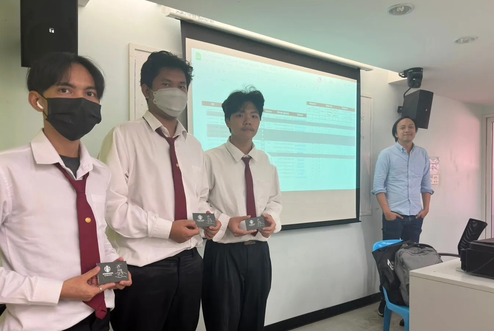

# Computer System Security
+ 19-4901-2006
+ ความมั่นคงปลอดภัยของระบบคอมพิวเตอร์

## Online Classes
+ [Nov 28, 2023](https://youtu.be/--J-o7B9L3E)
+ [Dec 7, 2023](https://youtu.be/PjfmIVBiMx4)
+ [Dec 19, 2023](https://youtu.be/NnTnY7JUuG4)

## Lecturer
+ [Maykin Warasart](https://www.google.com/search?q=Maykin+Warasart)
    + [เมฆินทร์ วรศาสตร์](https://www.google.com/search?q="เมฆินทร์ วรศาสตร์") (ເມຄິນ ວໍຣະສາດ, ຂວດ)

## Members
+ Kittikan Subkhum
    + กิตติกานต์ ทรัพย์ขำ
    + [GitHub](https://github.com/Kittikan1810)
    + [GitHub Page](https://Kittikan1810.github.io/)
    + [Decryption](https://kittikan1810.github.io/Decryption), [Hybrid Encryption](https://kittikan1810.github.io/Hybrid_encryption), [MD5](https://kittikan1810.github.io/MD5)
    + [Steganography](https://stylesuxx.github.io/steganography/)
        + [New Year Card](https://kittikan1810.github.io/HPN)
+ Kittiphat Prasopsuwan
    + กิตติพัฒน์ ประสพสุวรรณ
    + [GitHub](https://github.com/aomnutza58)
    + [GitHub Page](https://aomnutza58.github.io/)
    + [Asymmetric Encryption](https://aomnutza58.github.io/asymmetric_encryption), [Authentication](https://aomnutza58.github.io/Authentication), [Denial of Service](https://aomnutza58.github.io/denial_of_service) 
    + [Steganography](https://www.edchart.com/free-online-converters/steganographic-decoder.php)
        + [New Year Card](https://aomnutza58.github.io/Steganography)
    + Cert(s)
        + [Implementing and Operating Cisco Enterprise Network Core Technologies (ENCOR)](https://aomnutza58.github.io/CERTENCOR.html)
        + [Implementing Cisco Nexus Switches](https://aomnutza58.github.io/CERTNEXUS.html)
        + [WLAN Fundamental](https://aomnutza58.github.io/CERTWLAN.html)
        + [FCF](https://aomnutza58.github.io/CertFCF)
    + [PDPA](https://aomnutza58.github.io/PDPA)
+ Mintada Thongchai
    + มิณฐดา ทองไชย
    + [GitHub](https://github.com/MinFluk)
    + [GitHub Page](https://minfluk.github.io/)
    + [Digital Signature](https://minfluk.github.io/DigitalSignature), [Rootkit](https://minfluk.github.io/Rootkit), [Symmetric Encryption](https://minfluk.github.io/SymmetricEncryption)
    + [Steganography](https://stylesuxx.github.io/steganography/)
        + [New Year Card](https://minfluk.github.io/Steganography)
    + Cert(s)
        + [FCA](https://minfluk.github.io/fortigate)
        + [Intro to Dark Web](https://minfluk.github.io/SecBlueTeam.html)
+ Naratip Yaipangkaew
    + นราธิป ใยปางแก้ว
    + [GitHub](https://github.com/Mon5te2)
    + [GitHub Page](https://Mon5te2.github.io/)
    + [Ciphertext](https://mon5te2.github.io/Ciphertext), [Risk Assessment](https://mon5te2.github.io/RiskAssessment), [SQL Injection](https://mon5te2.github.io/SQLinjection)
    + [Steganography](https://stylesuxx.github.io/steganography/)
        + [New Year Card](https://mon5te2.github.io/Card)
    + Cert[s]
        + [FCF](https://mon5te2.github.io/FCF)
    + [PDPA](https://mon5te2.github.io/PDPA)
+ Natthanan Petdonthong
    + ณัฐนันท์ เพชรดอนทอง
    + [GitHub](https://github.com/Natthanan2002)
    + [GitHub Page](https://natthanan2002.github.io/)
    + [Base64](https://natthanan2002.github.io/Base64), [Honey pot](https://natthanan2002.github.io/HoneyPot), [Non-Repudiation](https://natthanan2002.github.io/Non-Repudiation)
    + [Steganography](https://stylesuxx.github.io/steganography/)
        + [New Year Card](https://natthanan2002.github.io/NewYearCard)
    + [PDPA](https://natthanan2002.github.io/PDPA)
+ Nontawat Sungtong
    + นนทวรรธ สังข์ทอง
    + [GitHub](https://github.com/NontawatstJo)
    + [GitHub Page](https://nontawatstjo.github.io/)
    + [Botnet](https://nontawatstjo.github.io/Botnet), [Malware](https://nontawatstjo.github.io/Malware), [Zero-day attack](https://nontawatstjo.github.io/Zero-day-attack)
+ Pannathorn Wiwatpornpipat
    + ปัณณธร วิวัฒน์พรพิพัฒน์
    + [GitHub](https://github.com/Toeng152)
    + [GitHub Page](https://toeng152.github.io/)
    + Cert(s)
        + [FCA](https://toeng152.github.io/fortigate)
        + [Intro to Dark Web](https://toeng152.github.io/security_blue_team)
    + [PDPA](https://toeng152.github.io/PDPA)
+ Suriya Heoachan
    + สุริยา เหว่าจันทร์
    + [GitHub](https://github.com/SuriyaNongnot)
    + [GitHub Page](https://suriyanongnot.github.io/)
+ Tanakorn Pramualpollapat
    + ธนากร ประมวลพลภัตต์
    + [GitHub](https://github.com/tanakorn5670)
    + [GitHub Page](https://tanakorn5670.github.io/)
    + Authorization, Least Privilege, Threat Vector
    + [Steganography](https://stylesuxx.github.io/steganography/)
        + [New Year Card](https://tanakorn5670.github.io/card)
    + Cert(s)
        + [Intro to Dark Web](https://tanakorn5670.github.io/SecBlueTeam)
+ Wanussanai Karin
    + วนัสนัย กะริน
    + [GitHub](https://github.com/freel2545)
    + [GitHub Page](https://freel2545.github.io/)
    + [Biometrics](https://freel2545.github.io/Biometrics), [Ransomware](https://freel2545.github.io/Ransomware), [Secure Shell (SSH)](https://freel2545.github.io/SecureShell)
    + [Steganography](https://stylesuxx.github.io/steganography/)
        + [New Year Card](https://freel2545.github.io/Steganography) 
    + Cert(s)
        + [FCA](https://freel2545.github.io/Cert_FortiGate7.4)
        + [Intro to Dark Web](https://freel2545.github.io/Cert_DarkWeb)
    + [PDPA](https://freel2545.github.io/PDPA)
+ Witsarut Khuntangtong
    + วิศรุต คุณทั่งทอง
    + [GitHub](https://github.com/witsarut42)
    + [GitHub Page](https://witsarut42.github.io/)
    + [Encryption](https://witsarut42.github.io/Encryption), [Key](https://witsarut42.github.io/Key), [Worm](https://witsarut42.github.io/Worm)
    + [Steganography](https://stylesuxx.github.io/steganography/)
        + [New Year Card](https://witsarut42.github.io/Card)
    + Cert(s)
        + [LCSI](https://witsarut42.github.io/Cert/LINK/LCSI.pdf)
        + [Intro to Cybersecurity](https://witsarut42.github.io/Cert/Cisco/IntroductionCybersecurity.pdf) - Cisco
        + [ISC2 CC](https://witsarut42.github.io/Cert/ISC2/ISC2%201M.pdf)
        + [Intro to Dark Web](https://witsarut42.github.io/Cert/Introduction-to-Dark-Web-Operations-Course/Introduction-to-Dark-Web-Operations-course.pdf)
    + [PDPA](https://witsarut42.github.io/PDPA)
+ Wuttipong Bunthai
    + วุฒิพงษ์ บุญไทย
    + [GitHub](https://github.com/kQx2003)
    + [GitHub Page](https://kqx2003.github.io/)
    + [Hashing](https://kqx2003.github.io/Hashing), [Penetration Testing](https://kqx2003.github.io/PenetrationTesting),[Phishing](https://kqx2003.github.io/Phishing)
    + [Steganography](https://stylesuxx.github.io/steganography/)
        + [New Year Card](https://kqx2003.github.io/Steganography)
    + Cert(s)
        + [FCA](https://kqx2003.github.io/fortigate)
        + [Intro to Dark Web](https://kqx2003.github.io/SecBlueTeam)
    + [PDPA](https://kqx2003.github.io/img/PDPA.jpg)

## Best Performance

## Vocabulary
+ Availability
+ Collision, Confidentiality
+ Input Validation, Integrity, IP Address
+ Patching, Private Key, Public Key
+ Session Hijacking, Social Engineering
+ Threat Model

## Misc.
+ [ISC2 Pledges One Million FREE ISC2 Certified in Cybersecurity Courses and Exams](https://www.isc2.org/landing/1mcc)
+ [SonarSource static code analysis](https://rules.sonarsource.com/)
+ [What is the difference between usability and user experience?](https://www.facebook.com/photo?fbid=752443273561861)
+ [Docker by aws](https://aws.amazon.com/th/docker/)
+ [Container in Azure](https://learn.microsoft.com/en-us/training/paths/administer-containers-in-azure/)
+ [Make (y)our GitHub Pages searchable by Google](https://yossieliaz.medium.com/how-to-make-your-github-pages-website-searchable-by-google-c6f481ca3a19)

 

