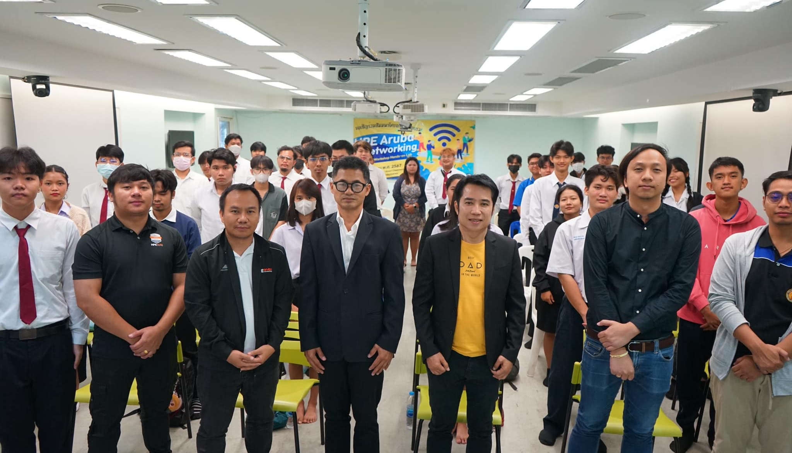
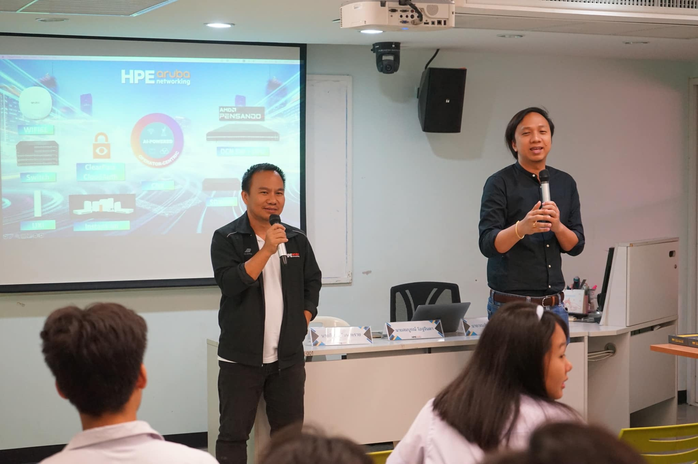

# IT Innovation Project 1
+ 19-4901-8502
+ โครงการนวัตกรรมทางเทคโนโลยีสารสนเทศ 1

## Classes
+ [July 2 (or 4), 2024](Slide/Day1_Course-Introduction_v1.0.pdf)
+ July 9, July 11, July 16, July 19, July 23, July 30, Aug 6, Aug 25, Aug 27, Sep 1, Sep 25, Sep 28 

## Lecturer
+ [Maykin Warasart](https://www.google.com/search?q=Maykin+Warasart)
    + [เมฆินทร์ วรศาสตร์](https://www.google.com/search?q="เมฆินทร์ วรศาสตร์")
    + [ເມຄິນ ວໍຣະສາດ, ຂວດ](https://www.google.com/search?q="ເມຄິນ ວໍຣະສາດ ຂວດ")

## Members
+ Kittikan Subkhum
    + กิตติกานต์ ทรัพย์ขำ
    + [GitHub](https://github.com/Kittikan1810), [GitHub Page](https://Kittikan1810.github.io/), [Credly](https://www.credly.com/users/kittikan)
    + Project Management - Self Study
        + [Generative AI Overview for Project Managers](https://www.credly.com/badges/2b6deca3-76d2-447e-a80a-ba39625c06b7/)
    
+ Kittiphat Prasopsuwan
    + กิตติพัฒน์ ประสพสุวรรณ
    + [GitHub](https://github.com/aomnutza58), [GitHub Page](https://aomnutza58.github.io/), [Credly](https://www.credly.com/users/kittiphat-prasopsuwan.8329778d)
    + Project Management - Self Study
        + [Fundamentals of Predictive Project Management](https://www.credly.com/badges/b332ea23-1ace-43b8-86bd-ec85b34d382a)
        + [Fundamentals of Agile Project Management](https://www.credly.com/earner/earned/badge/b358690a-b4ba-4cac-8c88-80b9f36b7e8a)
        + [Generative AI Overview for Project Managers](https://www.credly.com/earner/earned/badge/d1437119-ab8e-4403-a223-e3226e0d89e1)

+ Mintada Thongchai
    + มิณฐดา ทองไชย
    + [GitHub](https://github.com/MinFluk), [GitHub Page](https://minfluk.github.io/), [Credly](https://www.credly.com/users/fluk)
    + Project Management - Self Study
        + [Fundamentals of Predictive Project Management](https://www.credly.com/badges/6f18257c-66d7-454e-8ecb-b481e98ce234)
        + [Fundamentals of Agile Project Management](https://www.credly.com/badges/230d3a21-6964-4d85-848d-7f203af96afd)
        + [Generative AI Overview for Project Managers](https://www.credly.com/badges/91c5d7af-dbf1-45f3-9ce9-61c0dba3a9c6)
    
+ Naratip Yaipangkaew
    + นราธิป ใยปางแก้ว
    + [GitHub](https://github.com/Mon5te2), [GitHub Page](https://Mon5te2.github.io/), [Credly](https://www.credly.com/users/monster_z)
    + Project Management - Self Study
        + [Fundamentals of Predictive Project Management](https://www.credly.com/badges/d459da1b-39e7-4ee2-bfc8-77d1f25526e4)
        + [Fundamentals of Agile Project Management](https://www.credly.com/badges/6a668122-6428-4e7d-a102-00b0f92db498)
        + [Generative AI Overview for Project Managers](https://www.credly.com/badges/281d9617-54c8-47cb-b54b-ebad43671af2)

+ Natthanan Petdonthong
    + ณัฐนันท์ เพชรดอนทอง
    + [GitHub](https://github.com/Natthanan2002), [GitHub Page](https://natthanan2002.github.io/), [Credly](https://www.credly.com/users/natthanan2002)
    + Project Management - Self Study
        + [Fundamentals of Predictive Project Management](https://www.credly.com/badges/62da7219-fea1-46a6-9b96-c974e7bbe0bd)
        + [Fundamentals of Agile Project Management](https://www.credly.com/badges/370e0c59-5936-4c59-a467-e12b82b82bf8)
        + [Generative AI Overview for Project Managers](https://www.credly.com/badges/c2817891-0594-4856-a5c8-84ab3071b8bf)

+ Pannathorn Wiwatpornpipat
    + ปัณณธร วิวัฒน์พรพิพัฒน์
    + [GitHub](https://github.com/Toeng152), [GitHub Page](https://toeng152.github.io/)

+ Tanakorn Pramualpollapat
    + ธนากร ประมวลพลภัตต์
    + [GitHub](https://github.com/tanakorn5670), [GitHub Page](https://tanakorn5670.github.io/)

+ Wanussanai Karin
    + วนัสนัย กะริน
    + [GitHub](https://github.com/freel2545), [GitHub Page](https://freel2545.github.io/), [Credly](https://www.credly.com/users/freel5)
    + Project Management - Self Study
        + [Fundamentals of Predictive Project Management](https://www.credly.com/badges/d22a2c25-c778-4c5d-8e57-be2eba2a70fc)
        + [Fundamentals of Agile Project Management](https://www.credly.com/badges/45ae076d-5e02-4205-a3dc-dda9b0593cae)
        + [Generative AI Overview for Project Managers](https://www.credly.com/badges/05d1a3b1-fac6-4131-a4d7-1eed7491b44a)

+ Witsarut Khuntangtong
    + วิศรุต คุณทั่งทอง
    + [GitHub](https://github.com/witsarut42), [GitHub Page](https://witsarut42.github.io/)

+ Wuttipong Bunthai
    + วุฒิพงษ์ บุญไทย
    + [GitHub](https://github.com/kQx2003), [GitHub Page](https://kqx2003.github.io/), [Credly](https://www.credly.com/users/14-kq)
    + Project Management - Self Study
        + [Fundamentals of Predictive Project Management](https://www.credly.com/badges/802d630a-0e39-47ec-b65a-fd75bdd80e71)
        + [Fundamentals of Agile Project Management](https://www.credly.com/badges/51b8fd16-4f9d-4dc4-bd7f-02d6fd998178)
        + [Generative AI Overview for Project Managers](https://www.credly.com/badges/8c813483-53d4-4fda-95e0-696be442c3ca)

## Special Activity
+ HPE Aruba
    +      