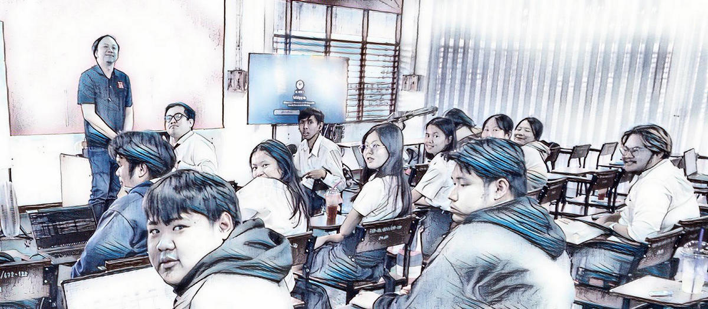
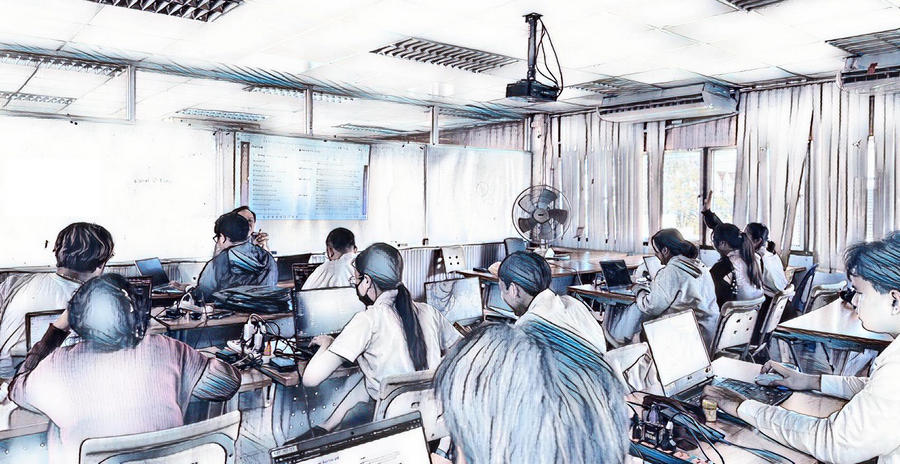

# Computer System Security
+ 19-40901-2105
+ ความมั่นคงปลอดภัยของระบบคอมพิวเตอร์

## Classes
[Nov 2, 2025](https://youtu.be/kxwJNbKa-t4) | 
[Nov 9, 2025](https://youtu.be/XlA7i13rXd4) | 
[Nov 14, 2025](https://youtu.be/doreuMeYFmM) | 
[Nov 16, 2025](https://youtu.be/aTESeeOKdGc) | 
[Nov 23, 2025](https://youtu.be/MbjYEAGdl0E) |
[Dec 7, 2025](https://youtu.be/WnuqHeKsezU) |
[Dec 14, 2025](https://youtu.be/ggrLUP_1BiQ) |
[Dec 19, 2025](https://youtu.be/Z-6qjocWtB4) |
[Dec 21, 2025](https://youtu.be/QTZnx5FqD94) |
[Dec 27, 2025](https://youtu.be/u5cGWt0KqMk)

## Students
+ Aekkaphat Daengpayon
    + GitHub : [playtwo2543](https://github.com/playtwo2543)
    + GitHub Page: [playtwo2543](https://playtwo2543.github.io)
    + Credly : [jxkpz](https://credly.com/users/jxkpz)
    + Glossary : [Java](https://playtwo2543.github.io/java), [Local Group](https://playtwo2543.github.io/local-group), [X.500](https://playtwo2543.github.io/X500)
    + Steg : [New Year](https://playtwo2543.github.io/new-year)
+ Apichit Duangsa
    + GitHub : [ApichitPek](https://github.com/ApichitPek)
    + GitHub Page: [apichitpek](https://apichitpek.github.io/)
    + Credly : [forst_darkness](https://www.credly.com/users/forst_darkness/)
    + Glossary : [Page](https://apichitpek.github.io/page), [Template](https://apichitpek.github.io/template), [Zone](https://apichitpek.github.io/zone)
+ Aroonphat Seehanan
    + GitHub : [Aroonphat](https://github.com/Aroonphat)
    + GitHub Page : [aroonphat](https://aroonphat.github.io/)
    + GitHub Page : [aroonphattt-03](https://aroonphattt-03.github.io/)
    + Credly : [aroonphat33](https://www.credly.com/users/aroonphat33/)
+ Boonmee
    + GitHub : [boonmeemira](https://github.com/boonmeemira)
    + GitHub Page : [boonmeemira](https://boonmeemira.github.io/)
    + Credly : [boonmee](https://www.credly.com/users/boonmee/)
    + Glossary : [BGP Speaker](https://boonmeemira.github.io/BGP-speaker), [CPU](https://boonmeemira.github.io/CPU), [Dig](https://boonmeemira.github.io/Dig)
+ Chutima Selakhun
    + GitHub : [Whalienz](https://github.com/Whalienz)
    + GitHub Page: [whalienz](https://whalienz.github.io/)
    + Credly : [whalienz52](https://www.credly.com/users/whalienz52/)
    + Glossary : [Dynamic Routing](https://whalienz.github.io/dynamic-routing), [Madman.mib](https://whalienz.github.io/madman-mib), [Node](https://whalienz.github.io/node)
+ Pajaree Noree
    + GitHub : [Domi-chan](https://github.com/Domi-chan)
    + GitHub Page: [domi-chan](https://domi-chan.github.io/)
    + Credly : [domi-chan](credly.com/users/domi-chan)
+ Panu Kason
    + GitHub : [PanuKason](https://github.com/PanuKason)
    + GitHub Page: [panukason](https://panukason.github.io/)
    + Credly : [panukason99](https://www.credly.com/users/panukason99/)
    + Glossary : [Backup Set](https://panukason.github.io/backup-set), [Circular Logging](https://panukason.github.io/circular-logging)
+ Phakanan Aiemsa-ard
    + GitHub : [Program-Phakanan](https://github.com/Program-Phakanan)
    + GitHub Page : [program-phakanan](https://program-phakanan.github.io/)
    + Credly : [phakanan.ae](https://www.credly.com/users/phakanan.ae/)
    + Glossary : [Authentication](https://program-phakanan.github.io/authentication), [Console](https://program-phakanan.github.io/console), [Firewall](https://program-phakanan.github.io/firewall)
+ Phattaphon Thongchan
    + GitHub : [aeng1596](https://github.com/aeng1596)
    + GitHub Page: [aeng1596](https://aeng1596.github.io/)
    + Credly : [phattaphon-aeng16](credly.com/users/phattaphon-aeng16)
    + Glossary : [Adapter Card](https://aeng1596.github.io/adapter-card), [Newsreader](https://aeng1596.github.io/newsreader), [Off-site Storage](https://aeng1596.github.io/off-site-storage)
+ Preeyanuch Beawbungkerd
    + GitHub : [Preeyanuchmimi](https://github.com/Preeyanuchmimi)
    + GitHub Page: [preeyanuchmimi](https://preeyanuchmimi.github.io/)
    + Credly : [preeyanuchmimi](https://www.credly.com/users/preeyanuchmimi)
    + Glossary : [Backup Log](https://preeyanuchmimi.github.io/backup-log), [CIDR](https://preeyanuchmimi.github.io/CIDR), [NAT](https://preeyanuchmimi.github.io/NAT)
+ Satakun Kaphon
    + GitHub : [Kum2546](https://github.com/Kum2546)
    + GitHub Page : [kum2546](https://kum2546.github.io/)
    + Credly : [kum2546](https://www.credly.com/users/kum2546)
    + Glossary : [Client](https://kum2546.github.io/Client), [Database](https://kum2546.github.io/Database), [Default](https://kum2546.github.io/Default)
+ Suparut Kumbungka
    + GitHub : [kocies](https://github.com/kocies)
    + GitHub Page : [kocies](https://kocies.github.io/)
    + Credly : [supakhim.ko](https://www.credly.com/users/supakhim.ko)
    + Glossary : [Archive Bit](https://kocies.github.io/archive-bit), [Keepalive Messages](https://kocies.github.io/keepalive-messages), [Network Printer](https://kocies.github.io/network-printer)
+ Teerapong Jansommit
    + GitHub : [mutodeiei](https://github.com/mutodeiei)
    + GitHub Page : [mutodeiei](https://mutodeiei.github.io/)
    + Glossary : [Hardware Profile](https://mutodeiei.github.io/glossary/hardware-profile), [Remote Network Backup](https://mutodeiei.github.io/glossary/remote-network-backup), [Terminal](https://mutodeiei.github.io/glossary/terminal)
+ Thanet Chomsri
    + GitHub : [Got2546](https://github.com/Got2546)
    + GitHub Page : [got2546](https://got2546.github.io/)
    + Credly : [tha_nex](credly.com/users/tha_nex)
    + Steg : [Christmas](https://got2546.github.io/Christmas)

## Lecturer
+ [Maykin Warasart](https://www.google.com/search?q="Maykin+Warasart"), PhD
    + [เมฆินทร์ วรศาสตร์](https://www.google.com/search?q="เมฆินทร์ วรศาสตร์") (ເມຄິນ ວໍຣະສາດ, ຂວດ)

## Glossary
[Adapter Card](https://aeng1596.github.io/adapter-card),
[Archive Bit](https://kocies.github.io/archive-bit),
[Authentication](https://program-phakanan.github.io/authentication),
[Backup Log](https://preeyanuchmimi.github.io/backup-log),
[Backup Set](https://panukason.github.io/backup-set),
[BGP Speaker](https://boonmeemira.github.io/BGP-speaker),
[CIDR](https://preeyanuchmimi.github.io/CIDR),
[Circular Logging](https://panukason.github.io/circular-logging),
[Client](https://kum2546.github.io/Client),
[Console](https://program-phakanan.github.io/console),
[CPU](https://boonmeemira.github.io/CPU),
[Database](https://kum2546.github.io/Database),
[Default](https://kum2546.github.io/Default),
[Dig](https://boonmeemira.github.io/Dig),
[Dynamic Routing](https://whalienz.github.io/dynamic-routing),
[Firewall](https://program-phakanan.github.io/firewall),
[Hardware Profile](https://mutodeiei.github.io/glossary/hardware-profile),
[Java](https://playtwo2543.github.io/java),
[Keepalive Messages](https://kocies.github.io/keepalive-messages),
[Local Group](https://playtwo2543.github.io/local-group),
[Madman.mib](https://whalienz.github.io/madman-mib),
[NAT](https://preeyanuchmimi.github.io/NAT),
[Network Printer](https://kocies.github.io/network-printer),
[Newsreader](https://aeng1596.github.io/newsreader),
[Node](https://whalienz.github.io/node),
[Off-site Storage](https://aeng1596.github.io/off-site-storage)
[Page](https://apichitpek.github.io/page),
[Remote Network Backup](https://mutodeiei.github.io/glossary/remote-network-backup),
[Template](https://apichitpek.github.io/template),
[Terminal](https://mutodeiei.github.io/glossary/terminal),
[X.500](https://playtwo2543.github.io/X500),
[Zone](https://apichitpek.github.io/zone)

## Misc.
+ [ISC2 Pledges One Million FREE ISC2 Certified in Cybersecurity Courses and Exams](https://www.isc2.org/landing/1mcc)
+ [CISSP Glossary](https://www.isc2.org/certifications/cissp/cissp-student-glossary)
+ [Cloud Security Glossary](https://cloudsecurityalliance.org/cloud-security-glossary)
+ [SonarSource static code analysis](https://rules.sonarsource.com/)
+ [What is the difference between usability and user experience?](https://www.facebook.com/photo?fbid=752443273561861)
+ [Docker by aws](https://aws.amazon.com/th/docker/)
+ [Container in Azure](https://learn.microsoft.com/en-us/training/paths/administer-containers-in-azure/)
+ [Make (y)our GitHub Pages searchable by Google](https://yossieliaz.medium.com/how-to-make-your-github-pages-website-searchable-by-google-c6f481ca3a19)
+ [Thailand - Website Security Standard](https://drive.ncsa.or.th/s/JLWCNF6ppaRjYmG)
+ [คู่มือการสอบสวนคดีอาชญากรรมทางเทคโนโลยี](https://officer.thaipoliceonline.go.th/resource/manual-officer.pdf)

 

